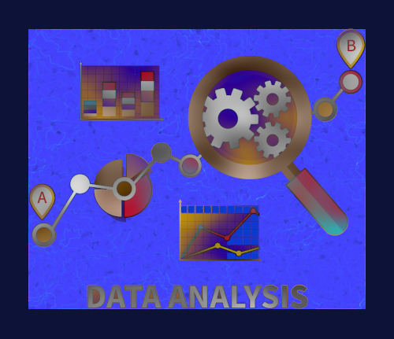

# CS101 Data Structures

Activity 04: Working with Files and Data

## Assigned and Due

- **Assigned**: Friday, 13 Feb 2026 at 9:00am
- **Due and Expiration**: Monday, 16 Feb 2026 at 9:00am

Note: the expiration date is the last date you can submit your work for a grade.



## Table of Contents
- [CS101 Data Structures](#cs101-data-structures)
  - [Assigned and Due](#assigned-and-due)
  - [Table of Contents](#table-of-contents)
  - [Overview](#overview)
  - [Learning Objectives](#learning-objectives)
  - [Project Goals](#project-goals)
  - [Instructions](#instructions)
  - [Deliverable](#deliverable)
  - [Submission](#submission)
  - [GatorGrade](#gatorgrade)
  - [Seeking Assistance](#seeking-assistance)

## Overview

In this activity you will complete three tutorials that focus on analyzing numerical data and text data. You will use the UV package manager to create project environments and run your code from the command line. Each tutorial provides working code that includes a few TODO markers for you to complete.

You will work with the following datasets, stored in a data directory inside each project:

- Iris flower measurements (numeric analysis)
- Sherlock Holmes excerpt (text analysis)
- Pride and Prejudice excerpt (text similarity challenge)


## Learning Objectives

By completing this activity, you will be able to:

1. **Manage Python project environments** using UV to initialize projects, create virtual environments, and install dependencies
2. **Apply statistical analysis techniques** to numerical datasets, including computing summary statistics, visualizing data distributions, and conducting hypothesis tests
3. **Process and analyze textual data** by implementing tokenization, frequency analysis, and similarity metrics to extract meaningful insights from text
4. **Utilize fundamental Python data structures** (lists, dictionaries, and conditionals) to solve real-world data analysis problems effectively


## Project Goals

- Create and use virtual environments with uv
- Run Python applications with uv run
- Practice lists, dictionaries, and conditional logic
- Produce statistical summaries, plots, and similarity metrics

 *A Scandal In Bohemia* by Arthur Conan Doyal

## Instructions

Complete the tutorials in order. Each tutorial has clear steps, command-line instructions, and example output to help you verify your work. In addition, there is Section "Understanding the Output" to explain how to understand the outputs. Cool, right?!

1. [Tutorial 1: Numerical Data Analysis](numeric_stats/tutorial_01.md)
2. [Tutorial 2: Text Analysis](text_analysis/tutorial_02.md)
3. [Tutorial 3: Text Similarity Challenge](text_similarity/tutorial_03.md)


## Deliverable

After you finish the tutorials, complete the writing assessment in [writing/reflection.md](writing/reflection.md).

You are submitting;

* The code from each tutorial
    * `numeric_stats/main.py`
    * `text_analysis/main.py`
    * `text_similarity/main.py`
* the Reflection document
  * `writing/reflection.md`


## Submission

Please commit and push your work regularly. Example commands:

```bash
git add -A
git commit -m "Describe your changes"
git push
```

After pushing, verify that your files appear in your GitHub repository.


## GatorGrade

You can check baseline requirements with:

```bash
gatorgrade --config config/gatorgrade.yml
```


## Seeking Assistance

Students who have questions about this project outside of the lab time are invited to ask in the course Discord channel or during office hours.
