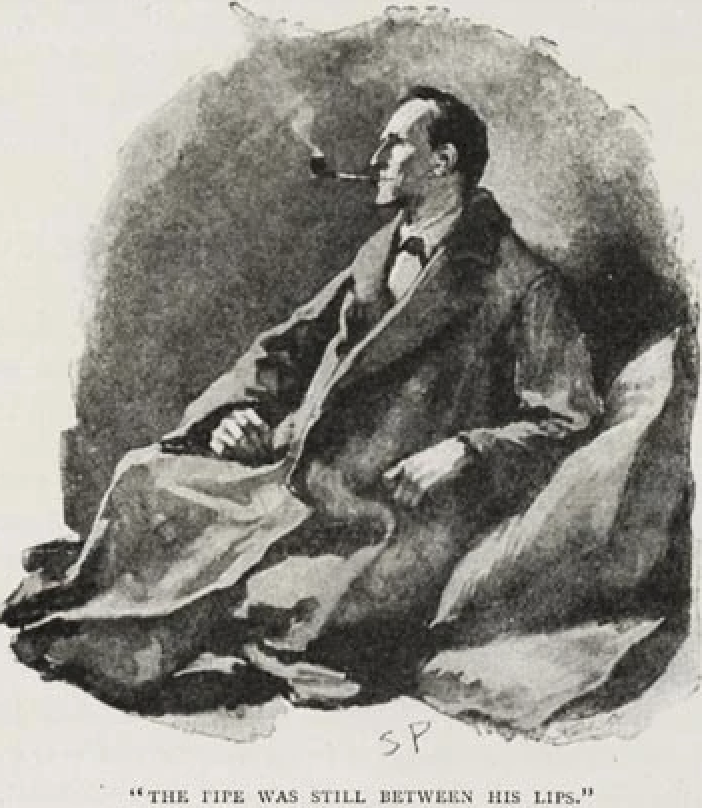

# Tutorial 2: Text Analysis

<center>



</center>

This might be a [*Three Pipe Problem!*](https://en.wiktionary.org/wiki/three-pipe_problem)

## Overview

In this tutorial you will analyze text data from a Sherlock Holmes excerpt. The program tokenizes text, builds word and letter frequencies, prints statistics, and creates plots. You will complete a few TODOs that practice lists, dictionaries, and conditionals.


## Part 1: Create the Project Environment

Move into the project folder:

``` bash
cd Act04_analysis/text_analysis
```

Initialize the project and create a virtual environment:

``` bash
uv init
```

Install the required packages:

``` bash
uv add pandas seaborn matplotlib plotly rich typer
```


## Part 2: Review the Code and Complete TODOs

Open [text_analysis/main.py](../text_analysis/main.py). The TODOs are short and focus on:

-   Building a token list with a list comprehension
-   Updating a dictionary inside a loop
-   Using a conditional to report word counts

### Hints

-   A simple token list can be made with: `token for token in cleaned.split() if token`
-   Update dictionary values with `freq[ch] = freq.get(ch, 0) + 1`
-   Use `if word in word_freq:` to branch the output


## Part 3: Run the Program

To get online help, you can use the following command.

``` bash
uv run main.py --help
```

To work with data, use the CLI to pass the input file and a lookup word:

``` bash
uv run main.py data/sherlock_holmes.txt --word detective --out-dir output
```

This command prints text statistics, shows top words, reports the chosen word frequency, and saves plots into the output folder.


Note, If you want, you could analyze the entire story of *A Scandal in Bohemia* by Arthur Conan Doyal.

``` bash
uv run main.py data/A_Scandal_In_Bohemia.txt --word detective --out-dir output
```

## Example Output (After Completing TODOs)

``` text
Text analysis results
Total tokens: 156
Unique tokens: 110
Average word length: 4.49

Top 10 Words
Rank  Word  Count
1     the   8
2     and   6
3     a     6
4     to    5
5     his   4
6     he    4
7     for   4
8     was   3
9     that  3
10    but   3

The word "detective" does not appear in the text.
Saved plots to output
```

You should see plot files saved in the output folder (a PNG chart and an HTML plot).


## Understanding the Output

### Text Statistics

The basic statistics provide an overview of the text:

- **Total tokens** (156): The number of words in the text after cleaning and splitting
- **Unique tokens** (110): The vocabulary size—how many distinct words appear
- **Average word length** (4.49): The typical length of words in characters

A high ratio of unique to total tokens (110/156 ≈ 70%) indicates diverse vocabulary with relatively little repetition.

### Top 10 Words Table

This ranked list shows the most frequently occurring words:

- **Function words** like "the", "and", "a", "to" dominate the top positions—this is typical in English text
- **Content words** like "detective", "mystery", or character names would appear lower in the ranking but carry more semantic meaning
- The counts reveal how often each word appears, helping identify themes and emphasis

### Word Lookup Feature

When you specify a `--word` parameter, the program searches for that exact word:

- If found: Reports how many times it appears (useful for tracking specific concepts or themes)
- If not found: Confirms the word doesn't exist in the text (as shown with "detective" in the example)

### Visualizations

The output folder contains two types of plots:

- **Letter frequency chart (PNG)**: Shows how often each letter appears, revealing patterns in the alphabet usage
- **Word frequency plot (HTML)**: An interactive visualization of the most common words, which you can explore in a browser

These visualizations make it easier to spot patterns that might not be obvious in numeric tables.


## What You Accomplished

You analyzed text with word and letter statistics and created visualizations using command-line input.

Next tutorial: [tutorial_03.md](../tutorial_03/tutorial_03.md)